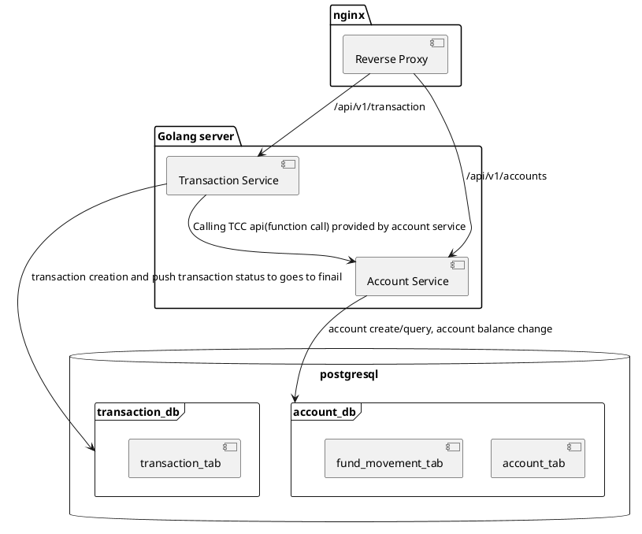

# Transfer System

## Overview

This transfer system facilitates financial transactions between accounts, ensuring data integrity and consistency using the TCC (Try-Confirm/Cancel) pattern. It is built with Docker Compose, using Nginx as a reverse proxy to direct requests to the appropriate service.

## Setup

### Prerequisites

- Docker
- Docker Compose

### Installation

1. Clone the repository:

   ```sh
   git clone https://github.com/your-repo/transfer-system.git
   cd transfer-system
   ```
2. Enviroment variables
 
    I put environment variables into docker-compose.yaml, such as db credentials. 

3. Start
   ```sh
   make run
   ```
  
4. The application should now be running, with Nginx proxying requests to the appropriate services.


## Usage

### Account Service Endpoints

- ***Create Account***
  
  ```http
  POST /api/v1/accounts
  ```
  
  ***Request Body***
  ```json
  {
    "account_id": 123, // Required
    "initial_balance": "100.23344" // Optional, default balance is 0
  }
  ```
  ***Response Code***
  ```http
  201 - Created success
  400 - Invalid parameters, like negative account balance or invalid balance like "123.a"
  409 - Duplicated account_id
  ```

- ***Query Account***
  
  ```http
  GET /api/v1/accounts/:account_id // account_id is required
  ```
  
 
  ***Response Code***
  ```http
  200 - Success
  400 - Invalid parameters, like missing account_id
  404 - Account not exists
  ```
  ***Response Body***
  ```json
  {
    message: "",
    data: {
      account_id: 123,
      balance: "100.23344"
    }
  }
  ```

### Transaction Service Endpoints

- ***Create Transaction***
  
  ```http
  POST /api/v1/transactions
  ```
  ***Request Body***
  ```json
  {
    source_account_id: 123,       // required
    destination_account_id: 456,  // required
    amount: "100.12345"           // required 
  }
  ```
 
  ***Response Code***
  ```http
  200 - Success
  400 - Invalid parameters, like missing account_id
  ```
  ***Response Body***
  ```json
  {
    message: "success",
    data: {
      transaction_id: "transaction-uuid",
      source_account_id: 123,
      destination_account_id: 456,
      amount: "100.12345",
      status: "fulfiled",
      created_at: "2024-06-24T03:44:11.816787Z",
      updated_at: "2024-06-24T03:44:11.833955Z",
    }
  }

## Technical Documentation

### Components
1. **Nginx**: Acts as a reverse proxy, directing requests to the appropriate service.
2. **Main API Service**: A single Golang server providing two main logical services:
   - **Account Service**: Handles account creation, querying, and balance updates.
   - **Transaction Service**: Manages transaction creation and ensures transactions reach their final status.
3. **PostgreSQL**: Used as the database backend, with two databases:
   - **account_db**: Contains `account_tab` and `fund_movement_tab`.
   - **transaction_db**: Contains `transaction_tab`.

### Database Schemas

#### account_db

- **account_tab**
  - `id` (SERIAL, PRIMARY KEY)
  - `account_id` (INT, UNIQUE)
  - `balance` (DECIMAL)
  - `created_at` (TIMESTAMP)
  - `updated_at` (TIMESTAMP)

- **fund_movement_tab**
  - `id` (SERIAL, PRIMARY KEY)
  - `transaction_id` (CHAR(36), UNIQUE)
  - `stage` (INT)
  - `source_account_id` (INT)
  - `destination_account_id` (INT)
  - `amount` (DECIMAL)
  - `created_at` (TIMESTAMP)
  - `updated_at` (TIMESTAMP)

#### transaction_db

- **transaction_tab**
  - `id` (SERIAL, PRIMARY KEY)
  - `transaction_id` (VARCHAR, UNIQUE, PRIMARY KEY)
  - `source_account_id` (INT)
  - `destination_account_id` (INT)
  - `amount` (DECIMAL)
  - `transaction_status` (INT)
  - `created_at` (TIMESTAMP)
  - `updated_at` (TIMESTAMP)

### System structure

Below is a flow chart illustrating the high-level flow of the system:



### Transaction Status

Below are the status of the transaction:

- Pending. Transacion in pending status will not have any fund changes in any account. A pending transaction means all users are valid and the transaction can be made when service recieve this request based on user's balance. 
- Processing. Transaction in pending status indicates source account have been deducted. Service start to deduct exact amount from source account. 
- Fulfiled. Transaction in Fulfiled status indicates destination account have been topped up. Service add exact amount to destination account. 
- Refunded. Transaction in Refunded status indicates previous deducted amount have been add back to source account, and destination account have no balance change in within this transacion. In rare cases(like the destination exceed amount limit), we need to return amount deducted from source acount back to it.

### TCC