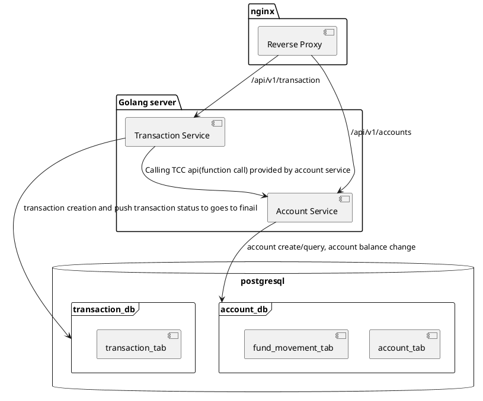
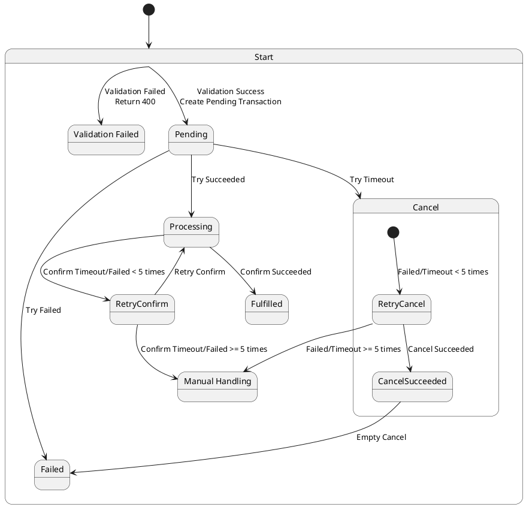

# Transfer System

## Overview

This transfer system facilitates financial transactions between accounts, ensuring data integrity and consistency using the TCC (Try-Confirm/Cancel) pattern. It is built with Docker Compose, using Nginx as a reverse proxy to direct requests to the appropriate service.

## Setup

### Prerequisites

- Docker
- Docker Compose

### Installation

1. Clone the repository:

   ```sh
   git clone https://github.com/your-repo/transfer-system.git
   cd transfer-system
   ```
2. Enviroment variables
 
    I put environment variables into docker-compose.yaml, such as db credentials. 

3. Start
   ```sh
   make run
   ```
  
4. The application should now be running and listening to port `8081`, with Nginx proxying requests to the appropriate services.

5. There is a `create_accounts.sh` under `scripts` folder, after service started, you can use it to create users. It will use the data in `account.json`.
You may need to run `chmod +x create_accounts.sh` to have execution permission


## Usage

### Assumptions

Users can make free transfer between each other with valid amount, and user can have pending transactions.

I'm using int64 to save balance, so there is a balance limit there. When I user make transfer, I'll make sure both side can send/recieve successfully

#### Amount check

 - Allow input string with maximum 6 decimal digits
 - Inside system, I inflate float value by 100000 and used to do calculation
 - When return amount to user, will deflate by 100000

 But this will bring one issue, cos I save amount in int64 in golang. So there will be a case destination account cannot add a certain amount due to exceed limit.
 The flow will be Try(deduct from user success) -> Confirm(add to user failed). In current design, I have to manually refund to source user(And this somehow violate TCC rules).

### Account Service Endpoints

- ***Create Account***
  
  ```http
  POST /api/v1/accounts
  ```
  
  ***Request Body***
  ```json
  {
    "account_id": 123, // Required
    "initial_balance": "100.23344" // Optional, default balance is 0
  }
  ```
  ***Response Code***
  ```http
  201 - Created success
  400 - Invalid parameters, like negative account balance or invalid balance like "123.a"
  409 - Duplicated account_id
  ```

- ***Query Account***
  
  ```http
  GET /api/v1/accounts/:account_id // account_id is required
  ```
  
 
  ***Response Code***
  ```http
  200 - Success
  400 - Invalid parameters, like missing account_id
  404 - Account not exists
  ```
  ***Response Body***
  ```json
  {
    "message": "",
    "data": {
      "account_id": 123,
      "balance": "100.23344"
    }
  }
  ```

### Transaction Service Endpoints

- ***Create Transaction***
  
  ```http
  POST /api/v1/transactions
  ```
  ***Request Body***
  ```json
  {
    "source_account_id": 123,       // required
    "destination_account_id": 456,  // required
    "amount": "100.12345"           // required 
  }
  ```
 
  ***Response Code***
  ```http
  200 - Success
  400 - Invalid parameters, like missing account_id
  ```
  ***Response Body***
  ```json
  {
    "message": "success",
    "data": {
      "transaction_id": "transaction-uuid",
      "source_account_id": 123,
      "destination_account_id": 456,
      "amount": "100.12345",
      "status": "fulfiled",
      "created_at": "2024-06-24T03:44:11.816787Z",
      "updated_at": "2024-06-24T03:44:11.833955Z",
    }
  }

## Technical Documentation

### Components
1. **Nginx**: Acts as a reverse proxy, directing requests to the appropriate service.
2. **Main API Service**: A single Golang server providing two main logical services:
   - **Account Service**: Handles account creation, querying, and balance updates.
   - **Transaction Service**: Manages transaction creation and ensures transactions reach their final status.
3. **PostgreSQL**: Used as the database backend, with two databases:
   - **account_db**: Contains `account_tab` and `fund_movement_tab`.
   - **transaction_db**: Contains `transaction_tab`.

### Database Schemas

#### account_db

For Account_tab. I maintained
 - `balance` to hold user's real balance
 - `in_balance` to hold the whole amount going to transfer in
 - `out_balance` to hold the whole aount going to transfer out
- **account_tab**
  - `id` (SERIAL, PRIMARY KEY)
  - `account_id` (INT, UNIQUE)
  - `balance` (BIGINT) 
  - `in_balance` (BIGINT)
  - `out_balance` (BIGINT)
  - `created_at` (TIMESTAMP)
  - `updated_at` (TIMESTAMP)

- **fund_movement_tab**
  - `id` (SERIAL, PRIMARY KEY)
  - `transaction_id` (CHAR(36), UNIQUE)
  - `stage` (INT)
  - `source_account_id` (INT)
  - `destination_account_id` (INT)
  - `amount` (DECIMAL)
  - `created_at` (TIMESTAMP)
  - `updated_at` (TIMESTAMP)

#### transaction_db

- **transaction_tab**
  - `id` (SERIAL, PRIMARY KEY)
  - `transaction_id` (VARCHAR, UNIQUE, PRIMARY KEY)
  - `source_account_id` (INT)
  - `destination_account_id` (INT)
  - `amount` (DECIMAL)
  - `transaction_status` (INT)
  - `created_at` (TIMESTAMP)
  - `updated_at` (TIMESTAMP)

### System structure

Below is a flow chart illustrating the high-level flow of the system:



### Transaction Status

Below are the status of the transaction:

- Pending. Transacion in pending status will not have any fund changes in any account. A pending transaction means all users are valid and the transaction can be made when service recieve this request based on user's balance. 
- Processing. Transaction in processing status indicates both account have tried to send/recieve fund. 
- Fulfiled. Transaction in Fulfiled status indicates source balance have been deduct and destination balance have been added. 
- Failed. Transaction in Failed status indicates fund was never moved successfully, it can be request validation failed, or try timeout.

### Fund Movement Stage

Fund movement table used to record fund changes status, and TCC relying on it to be idempotent. Fund movement record and balance change will be done with a transaction, to make sure every fund change is ovserveble. 

- SourceOnHold. Indicates fund is deducted from source account. 
- DestConfirmed. Indicates fund is added to destination account.
- Refunded. Indicates fund return to source account.

### TCC

Here is the transaction status diagram with TCC actions. Basic rules are:

- Try. In try will verify on both side, if sender is able to send and reciever is able to recieve. If try success, will garantee Confirm will be success. If try timeout, should call Cancel.
- Confirm. Only successed Try will trigger Confirm, in Confirm, will modifiy user's balance as well as on hold amount(`in_balance`/`out_balance`).
- Cancel. Only call cancel when Try is timeout. In this case, Transaction service is not sure if Account Service Try sucess or not. So to keep it safe, just call Cancel.



After TCC action success(or failed), we are going to change transaction status. Since they are two distributed db, chances are that transaction db update failed. In this case, we may need a reconsolation service, subscribe to fund movement change, and do accounting against transaction table, to make sure final data integrety. 

Also I provided a Retry api, to retry transaction. Since TCC is idempotent, it's safe to retry the not finanlised transactions.

