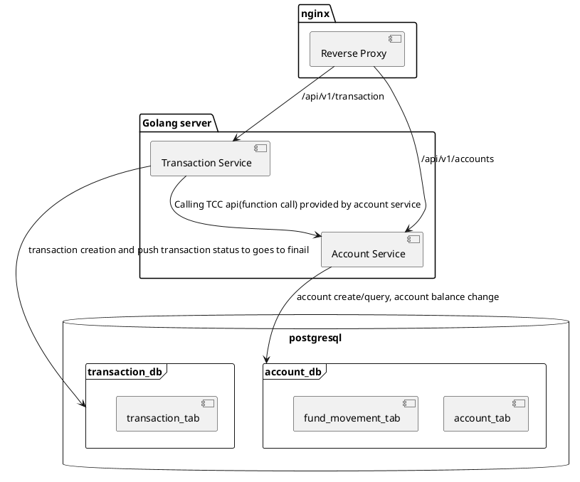

# Transfer System

## Overview

This transfer system facilitates financial transactions between accounts, ensuring data integrity and consistency using the TCC (Try-Confirm/Cancel) pattern. It is built with Docker Compose, using Nginx as a reverse proxy to direct requests to the appropriate service.

## Setup

### Prerequisites

- Docker
- Docker Compose

### Installation

1. Clone the repository:

   ```sh
   git clone https://github.com/your-repo/transfer-system.git
   cd transfer-system
   ```

2. Start
   ```sh
   make run
   ```


### Components
1. **Nginx**: Acts as a reverse proxy, directing requests to the appropriate service.
2. **Main API Service**: A single Golang server providing two main logical services:
   - **Account Service**: Handles account creation, querying, and balance updates.
   - **Transaction Service**: Manages transaction creation and ensures transactions reach their final status.
3. **PostgreSQL**: Used as the database backend, with two databases:
   - **account_db**: Contains `account_tab` and `fund_movement_tab`.
   - **transaction_db**: Contains `transaction_tab`.

### Database Schemas

#### account_db

- **account_tab**
  - `account_id` (INT, PRIMARY KEY)
  - `balance` (DECIMAL)
  - `created_at` (TIMESTAMP)
  - `updated_at` (TIMESTAMP)

- **fund_movement_tab**
  - `id` (SERIAL, PRIMARY KEY)
  - `transaction_id` (INT, UNIQUE)
  - `direction` (VARCHAR)
  - `source_account_id` (INT)
  - `destination_account_id` (INT)
  - `amount` (DECIMAL)
  - `created_at` (TIMESTAMP)
  - `updated_at` (TIMESTAMP)

#### transaction_db

- **transaction_tab**
  - `transaction_id` (VARCHAR, UNIQUE, PRIMARY KEY)
  - `source_account_id` (INT)
  - `destination_account_id` (INT)
  - `amount` (DECIMAL)
  - `status` (VARCHAR)
  - `created_at` (TIMESTAMP)
  - `updated_at` (TIMESTAMP)

### Flow Chart

Below is a flow chart illustrating the high-level flow of the system:

